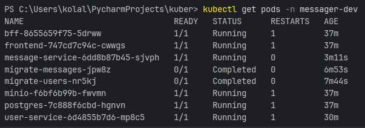
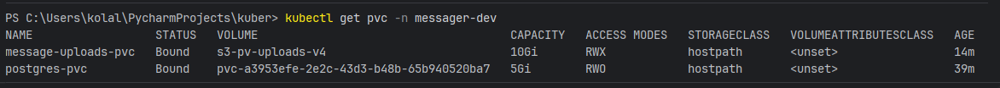
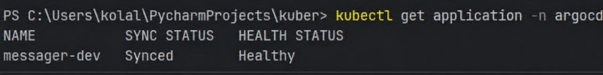
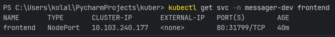

# Лабораторная работа: Запуск 
микросервисного приложения в Kubernetes

## Используемые технологии

- **Kubernetes** (Docker Desktop)
- **kustomize** — управление конфигурациями (dev/prod)
- **Argo CD** — GitOps деплой
- **S3 CSI** (ru.yandex.s3.csi) — хранилище файлов через MinIO
- **PostgreSQL** — база данных
- **MinIO** — S3-совместимое хранилище
- **Goose** — миграции БД

## Описание
Развёртывание мессенджера в Kubernetes с использованием S3 CSI, kustomize и Argo CD.

## Структура репозитория
- `k8s/base/` - базовые манифесты
- `k8s/overlays/dev/` - конфигурация для разработки
- `k8s/overlays/prod/` - конфигурация для production
- `argocd/` - Argo CD Application
- `docs/` - скриншоты

## Запуск
```bash
# Применение через Argo CD
kubectl apply -f argocd/application-dev.yaml
```

## Статус подов


## Статус PVC


## Argo CD


## Фронтенд

